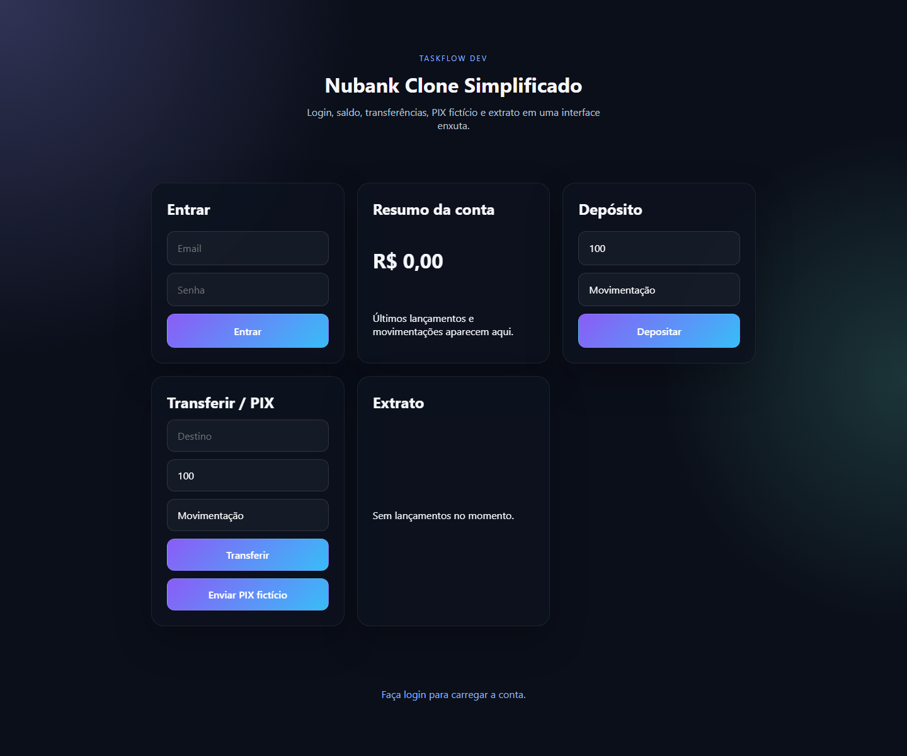

<h1>Nubank Clone Simplificado</h1>

  
  
  
  
  

  Aplicação fullstack de demonstração financeira inspirada em fluxos bancários modernos. O objetivo é evidenciar regras de negócio, controle transacional, autenticação com JWT, persistência em PostgreSQL, uso pragmático de Redis e uma interface leve em React.

<h2>Visão Geral</h2>

O projeto simula um ambiente bancário simplificado com:

<ul>
  <li>cadastro e autenticação de usuários;</li>
  <li>conta com controle de saldo;</li>
  <li>transferências internas;</li>
  <li>PIX fictício;</li>
  <li>extrato de movimentações;</li>
  <li>dashboard com resumo da conta;</li>
  <li>cache de leitura para consultas frequentes.</li>
</ul>

O sistema não integra serviços bancários reais. Todo o domínio é fictício e seguro para fins de portfólio.

<h2>Stack</h2>
<ul>
  <li>Java 21</li>
  <li>Spring Boot</li>
  <li>Spring Security</li>
  <li>JWT</li>
  <li>PostgreSQL</li>
  <li>Redis</li>
  <li>React</li>
  <li>TypeScript</li>
  <li>Vite</li>
  <li>Docker</li>
  <li>Docker Compose</li>
  <li>Swagger/OpenAPI</li>
  <li>JUnit</li>
  <li>Mockito</li>
</ul>

<h2>Funcionalidades</h2>
<ul>
  <li>Registro e login com JWT</li>
  <li>Proteção de endpoints autenticados</li>
  <li>Controle de conta e saldo</li>
  <li>Depósito, transferência e PIX fictício</li>
  <li>Extrato com persistência das movimentações</li>
  <li>Cache de resumo de conta com Redis</li>
  <li>Documentação da API com Swagger</li>
</ul>

<h2>Arquitetura</h2>
<h3>Backend</h3>
<ul>
  <li><code>auth/</code> autenticação e emissão de token</li>
  <li><code>account/</code> conta, saldo e operações financeiras</li>
  <li><code>statement/</code> extrato</li>
  <li><code>dashboard/</code> leitura consolidada</li>
  <li><code>report/</code> exportação de relatório</li>
  <li><code>cache/</code> leitura otimizada com Redis</li>
  <li><code>security/</code> filtro e validação de JWT</li>
  <li><code>config/</code> segurança, OpenAPI e propriedades</li>
  <li><code>exception/</code> tratamento centralizado de erros</li>
</ul>
<h3>Frontend</h3>

A interface web foi construída em React com TypeScript e Vite, com foco em navegação enxuta e fluxo bancário básico:

<ul>
  <li>login;</li>
  <li>dashboard;</li>
  <li>transferências;</li>
  <li>PIX;</li>
  <li>extrato;</li>
  <li>resumo de conta.</li>
</ul>

<h2>Estrutura do Projeto</h2>
<ul>
  <li><code>backend/</code> API Spring Boot</li>
  <li><code>frontend/</code> interface React</li>
  <li><code>docker-compose.yml</code> serviços locais de apoio</li>
  <li><code>.env.example</code> variáveis de ambiente esperadas</li>
</ul>

<h2>Como Executar Localmente</h2>
<ol>
  <li>Copie <code>.env.example</code> para <code>.env</code>.</li>
  <li>Suba a infraestrutura:
    <pre><code>docker compose up -d</code></pre>
  </li>
  <li>Inicie o backend:
    <pre><code>.\mvnw.cmd -f backend\pom.xml spring-boot:run</code></pre>
  </li>
  <li>Em outro terminal, inicie o frontend:
    <pre><code>cd frontend
npm install
npm run dev</code></pre>
  </li>
</ol>

<h2>Documentação da API</h2>

Após subir o backend, a documentação fica disponível em <code>http://localhost:8080/swagger-ui/index.html</code>.

<h2>Testes</h2>
<pre><code>.\mvnw.cmd -f backend\pom.xml test
cd frontend
npm run build</code></pre>

<h2>Captura de Execução</h2>

  

<h2>Decisões de Projeto</h2>
<ul>
  <li>PostgreSQL foi mantido como fonte de verdade.</li>
  <li>Redis é usado apenas para acelerar leituras de resumo.</li>
  <li>O frontend foi mantido simples para destacar o fluxo de produto, e não uma camada visual complexa.</li>
  <li>As regras de negócio vivem em services, evitando lógica espalhada em controllers.</li>
</ul>

<h2>Melhorias Futuras</h2>
<ul>
  <li>expandir o extrato com filtros e paginação;</li>
  <li>adicionar notificações de limite;</li>
  <li>criar dashboard com gráficos mais ricos;</li>
  <li>incorporar testes end-to-end para os principais fluxos.</li>
</ul>
